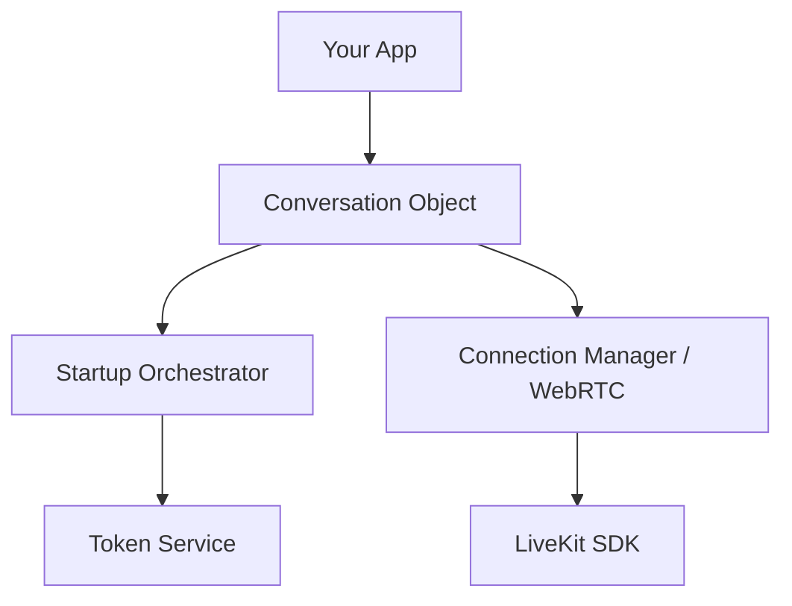

# ElevenLabs Conversational AI Swift SDK


A Swift SDK for integrating ElevenLabs' conversational AI capabilities into your iOS and macOS applications. Built on top of LiveKit WebRTC for real-time audio streaming and communication.

---

## Why ElevenLabs Swift SDK?

- **Ultra-Low Latency**: Built on LiveKit WebRTC for high-performance, real-time audio streaming.
- **Human-Like Interaction**: Seamlessly handle interruptions and natural speech patterns.
- **Dev-First API**: Fully supports Swift Concurrency (Async/Await) and SwiftUI observation.
- **Extensible**: Native support for Client Tools and MCP (Model Context Protocol).
- **Native Performance**: Optimized for iOS and macOS, ensuring buttery-smooth UI.

---

## Quick Start

### 1. Installation

Add the package via Swift Package Manager:

```swift
dependencies: [
    .package(url: "https://github.com/elevenlabs/elevenlabs-swift-sdk.git", from: "2.1.0")
]
```

### 2. Requirements & Permissions

- **Platforms**: iOS 13.0+ · macOS 10.15+ · macCatalyst 14.0+ · visionOS 1.0+ · tvOS 17.0+
- **Tooling**: Xcode 15.0+ · Swift 5.9+
- **Privacy**: Add `NSMicrophoneUsageDescription` to your `Info.plist`. If connecting on local networks, you may also need `NSLocalNetworkUsageDescription`.

### 3. Basic Usage (SwiftUI)

The SDK is designed to be reactive. Simply observe the `Conversation` object and the UI will update automatically as the AI speaks and generates transcripts.

```swift
import ElevenLabs
import SwiftUI

@MainActor
class ChatViewModel: ObservableObject {
    @Published var conversation: Conversation?
    
    func startChat() async {
        do {
            // Start session with a public agent ID
            conversation = try await ElevenLabs.startConversation(agentId: "your-agent-id")
        } catch {
            print("Failed to start: \(error)")
        }
    }
}

struct ChatView: View {
    @StateObject var vm = ChatViewModel()
    
    var body: some View {
        VStack(spacing: 20) {
            if let conversation = vm.conversation {
                // Connection state
                Group {
                    switch conversation.state {
                    case .idle: Text("Status: idle")
                    case .connecting: Text("Status: connecting")
                    case .active(let info): Text("Connected to: \(info.agentId)")
                    case .ended: Text("Status: ended")
                    case .error: Text("Status: error")
                    }
                }
                .font(.caption).foregroundColor(.secondary)
                
                // Real-time transcriptions
                ScrollViewReader { proxy in
                    ScrollView {
                        ForEach(conversation.messages) { msg in
                            Text("**\(msg.role)**: \(msg.content)")
                                .padding(8).background(Color.gray.opacity(0.1)).cornerRadius(8)
                                .id(msg.id)
                        }
                    }
                    .onChange(of: conversation.messages.count) { _ in
                        proxy.scrollTo(conversation.messages.last?.id)
                    }
                }
                
                Button("End Conversation", role: .destructive) {
                    Task { await conversation.endConversation() }
                }
            } else {
                Button("Start Voice Chat") {
                    Task { await vm.startChat() }
                }
                .buttonStyle(.borderedProminent)
            }
        }
        .padding()
    }
}
```

### Cancel connecting

If you need to stop connecting (e.g., the user leaves the screen before the connection completes), start the session inside a `Task` and cancel it:

```swift
// Start connecting
let connectTask = Task { () -> Conversation in
    try await ElevenLabs.startConversation(agentId: "your-agent-id")
}

// Cancel connecting
connectTask.cancel()
```

---

## Authentication Modes

### Public Agents

Perfect for prototyping. Connect directly using your Agent ID from the ElevenLabs dashboard.

```swift
let conversation = try await ElevenLabs.startConversation(agentId: "my-public-id")
```

### Private Agents (Production Ready)

For private agents, your backend should generate a temporary **Conversation Token** using your API Key. This keeps your credentials secure.

> [!CAUTION]
> **Security First**: Never store your ElevenLabs API Key directly in your mobile app. Always use a backend proxy.

```swift
// 1. Fetch token from YOUR secure backend
let token = try await myBackend.fetchToken(agentId: "my-private-id")

// 2. Start session safely
let conversation = try await ElevenLabs.startConversation(
    conversationToken: token
)
```

---

## Empower Your Agent with Tools

You can allow your agent to perform actions in your app (like opening a screen or fetching local data) using **Client Tools**.

```swift
// Observe requested tool calls
conversation.$pendingToolCalls
    .receive(on: DispatchQueue.main)
    .sink { calls in
        for call in calls {
            Task {
                // 1. Parse parameters
                let params = (try? call.getParameters()) ?? [:]

                // 2. Perform your local logic
                let result = await myAppAction(params)
                // 3. Send result back to the agent
                try? await conversation.sendToolResult(for: call.toolCallId, result: result)
            }
        }
    }
    .store(in: &cancellables)
```

> [!TIP]
> Check out the [Advanced Usage Guide](Documentation/Usage.md) for full MCP tool integration and complex scenarios.

---

## Configuration & Tuning

### Global Setup

Configure logging and global behaviors at app launch:

```swift
ElevenLabs.configure(
    ElevenLabs.Configuration(logLevel: .info) 
)
```

### Fine-Grained Callbacks

Want to handle events without Combine? Use `ConversationConfig`:

```swift
let config = ConversationConfig(
    onAgentResponse: { text, _ in print("Agent said: \(text)") },
    onUserTranscript: { text, _ in print("User said: \(text)") },
    onVadScore: { score in print("Voice intensity: \(score)") }
)

let conversation = try await ElevenLabs.startConversation(agentId: "id", config: config)
```

---

## Architecture at a Glance

The SDK handles all the heavy lifting of WebRTC coordination and protocol parsing, exposing a simple, thread-safe interface.



---

## Contributing

We love contributions!

- **Tests**: Ensure all tests pass with `swift test`.
- **Patterns**: Adhere to Swift Concurrency best practices (Actors/MainActor).

Explore our [Usage Documentation](Documentation/Usage.md) for more depth.
