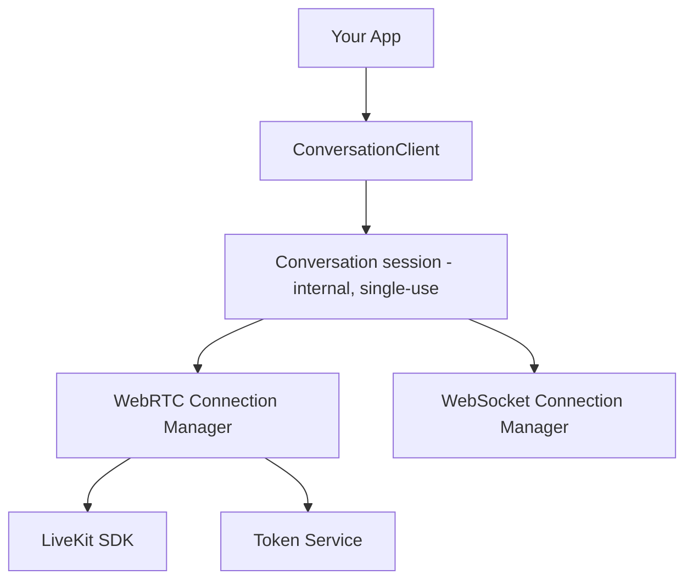

# ElevenAgents Swift SDK


A Swift SDK for integrating ElevenAgents capabilities into your iOS and macOS applications. Built on top of LiveKit WebRTC for real-time audio streaming and communication.

---

## Why ElevenLabs Swift SDK?

- **Ultra-Low Latency**: Built on LiveKit WebRTC for high-performance, real-time audio streaming.
- **Human-Like Interaction**: Seamlessly handle interruptions and natural speech patterns.
- **Dev-First API**: Fully supports Swift Concurrency (Async/Await) and SwiftUI observation.
- **Extensible**: Native support for Client Tools and MCP (Model Context Protocol).
- **Native Performance**: Optimized for iOS and macOS, ensuring buttery-smooth UI.

---

## Quick Start

### 1. Installation

Add the package via Swift Package Manager:

```swift
dependencies: [
    .package(url: "https://github.com/elevenlabs/elevenlabs-swift-sdk.git", from: "3.2.0")
]
```

### 2. Requirements & Permissions

- **Platforms**: iOS 13.0+ · macOS 10.15+ · macCatalyst 14.0+ · visionOS 1.0+ · tvOS 17.0+
- **Tooling**: Xcode 15.0+ · Swift 5.9+
- **Privacy**: Add `NSMicrophoneUsageDescription` to your `Info.plist`. If connecting on local networks, you may also need `NSLocalNetworkUsageDescription`.

### 3. Basic Usage (SwiftUI)

The SDK is designed to be reactive. Hold a `ConversationClient` as a `@StateObject` and observe it directly — the UI updates automatically as the agent connects, speaks, and generates transcripts. The client is durable and reusable: call `start(auth:)` to begin a session and `start` again later to begin another.

```swift
import ElevenLabs
import SwiftUI

struct ChatView: View {
    @StateObject private var client = ConversationClient()

    var body: some View {
        VStack(spacing: 20) {
            // Connection state
            Group {
                switch client.state {
                case .idle: Text("Status: idle")
                case .connecting(let phase): Text("Status: connecting (\(phase))")
                case .connected: Text("Status: connected")
                case .ended(let reason): Text("Status: ended (\(reason))")
                case .startupFailed(let failure): Text("Status: failed (\(failure))")
                }
            }
            .font(.caption).foregroundColor(.secondary)

            // Real-time transcriptions
            ScrollViewReader { proxy in
                ScrollView {
                    ForEach(client.messages) { msg in
                        Text("**\(msg.role)**: \(msg.content)")
                            .padding(8).background(Color.gray.opacity(0.1)).cornerRadius(8)
                            .id(msg.id)
                    }
                }
                .onChange(of: client.messages.count) { _ in
                    proxy.scrollTo(client.messages.last?.id)
                }
            }

            if client.state == .connected {
                Button("End Conversation", role: .destructive) {
                    Task { await client.endConversation() }
                }
            } else {
                Button("Start Voice Chat") {
                    Task {
                        do {
                            try await client.start(auth: .publicAgent(id: "your-agent-id"))
                        } catch {
                            print("Failed to start: \(error)")
                        }
                    }
                }
                .buttonStyle(.borderedProminent)
            }
        }
        .padding()
    }
}
```

### Cancel connecting

If you need to stop connecting (e.g., the user leaves the screen before the connection completes), start the session inside a `Task` and cancel it:

```swift
// Start connecting
let connectTask = Task {
    try await client.start(auth: .publicAgent(id: "your-agent-id"))
}

// Later, if the user leaves before the connection completes:
connectTask.cancel()
```

---

## Authentication Modes

### Public Agents

Perfect for prototyping. Connect directly using your Agent ID from the ElevenLabs dashboard.

```swift
let client = ConversationClient()
try await client.start(auth: .publicAgent(id: "my-public-id"))
```

### Private Agents (Production Ready)

For private agents, your backend should generate a temporary **Conversation Token** using your API Key. This keeps your credentials secure.

> [!CAUTION]
> **Security First**: Never store your ElevenLabs API Key directly in your mobile app. Always use a backend proxy.

```swift
// 1. Fetch token from YOUR secure backend
let token = try await myBackend.fetchToken(agentId: "my-private-id")

// 2. Start session safely
let client = ConversationClient()
try await client.start(auth: .conversationToken(token))
```

---

## Text-Only Conversations

Skip the microphone entirely and run a chat-style conversation over WebSocket. The `ConversationClient` API is identical — `sendMessage`, `messages`, `endConversation` all work the same; just opt in with `textOnly`.

```swift
// Public agent
let client = ConversationClient()
try await client.start(
    auth: .publicAgent(id: "your-agent-id"),
    config: .init(textOnly: true)
)

try await client.sendMessage("Hello!")

// Private agent: backend generates a signed WebSocket URL
let signedURL = try await myBackend.fetchSignedWebSocketURL(agentId: "my-private-id")
let textClient = ConversationClient()
try await textClient.start(
    auth: .signedWebSocketURL(signedURL),
    config: .init(textOnly: true)
)
```

---

## Empower Your Agent with Tools

You can allow your agent to perform actions in your app (like opening a screen or fetching local data) using **Client Tools**.

```swift
// Observe requested tool calls with async/await
Task {
    for await calls in client.$pendingToolCalls.values {
        for call in calls {
            // 1. Parse parameters
            let params = (try? call.getParameters()) ?? [:]

            // 2. Perform your local logic
            let result = await myAppAction(params)

            // 3. Send result back to the agent
            try? await client.sendToolResult(for: call.toolCallId, result: result)
        }
    }
}
```

> [!TIP]
> Check out the [Advanced Usage Guide](Documentation/Usage.md) for full MCP tool integration and complex scenarios.

---

## Configuration & Tuning

### Logging

Set the SDK's diagnostic verbosity per conversation via `ConversationConfig` (defaults to `.warning`):

```swift
let config = ConversationConfig(logLevel: .info) // .trace for full event logs
let client = ConversationClient()
try await client.start(auth: .publicAgent(id: "your-agent-id"), config: config)
```

### Custom Endpoints

Front ElevenLabs through a proxy/gateway, a regional/data-residency host, or a staging deployment by setting `endpoints` on `ConversationConfig` (or on `ChatWidget`):

```swift
// Everything behind one API host (token/text/REST derived from it):
let endpoints = ElevenLabsEndpoints.apiBase(URL(string: "https://my-proxy.example.com")!)

let client = ConversationClient()
try await client.start(
    auth: .publicAgent(id: "your-agent-id"),
    config: .init(endpoints: endpoints)
)

// Or override individual endpoints (e.g. a custom LiveKit host); any omitted
// endpoint falls back to production:
let custom = ElevenLabsEndpoints(
    voiceWebSocket: URL(string: "wss://livekit.my-region.example.com")!
)
```

### Fine-Grained Callbacks

Want to handle events without Combine? Pass `ConversationCallbacks` when creating the client:

```swift
let callbacks = ConversationCallbacks(
    onAgentResponse: { text, _ in print("Agent said: \(text)") },
    onUserTranscript: { text, _ in print("User said: \(text)") },
    onVadScore: { score in print("Voice intensity: \(score)") }
)

let client = ConversationClient(callbacks: callbacks)
try await client.start(auth: .publicAgent(id: "id"))
```

---

## Architecture at a Glance

The SDK handles all the heavy lifting of WebRTC coordination and protocol parsing, exposing a simple, thread-safe interface.


```mermaid
graph TD
    App[Your App] --> ConversationClient[ConversationClient]
    ConversationClient --> Conversation[Conversation session - internal, single-use]
    Conversation --> WebRTCConnectionManager[WebRTC Connection Manager]
    Conversation --> WebSocketConnectionManager[WebSocket Connection Manager]
    WebRTCConnectionManager --> LiveKit[LiveKit SDK]
    WebRTCConnectionManager --> TokenService[Token Service]
```

---

## Contributing

We love contributions!

- **Tests**: Ensure all tests pass with `swift test`.
- **Patterns**: Adhere to Swift Concurrency best practices (Actors/MainActor).

Explore our [Usage Documentation](Documentation/Usage.md) for more depth.

---

## Releasing

To release a new version of the SDK, use the [Claude Code](https://docs.anthropic.com/en/docs/claude-code) release command:

```bash
claude /release <version>
```

This will update version strings, lint, run checks, open a PR, and (after merge) tag the release to make it available via [Swift Package Manager](https://www.swift.org/documentation/package-manager/).
