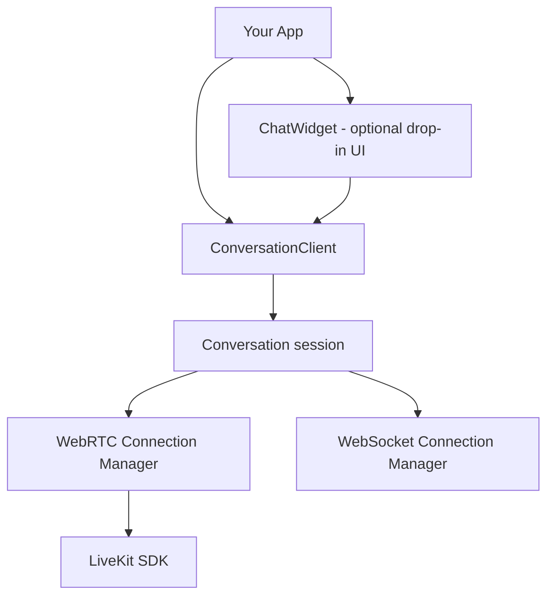

# ElevenAgents Swift SDK


A Swift SDK for integrating ElevenAgents capabilities into your iOS and macOS applications. Built on top of LiveKit WebRTC for real-time audio streaming and communication.

---

## Why ElevenLabs Swift SDK?

- **Ultra-Low Latency**: Built on LiveKit WebRTC for high-performance, real-time audio streaming.
- **Human-Like Interaction**: Seamlessly handle interruptions and natural speech patterns.
- **Drop-In Widget**: Ship a complete agent chat UI — voice calls, text input, live transcript, audio-reactive orb — with one view.
- **Dev-First API**: Fully supports Swift Concurrency (Async/Await), SwiftUI observation, and Swift 6 strict concurrency.
- **Extensible**: Native support for Client Tools and MCP (Model Context Protocol).
- **Native Performance**: Optimized for iOS and macOS, ensuring buttery-smooth UI.

---

## Quick Start

### 1. Installation

Add the package via Swift Package Manager. While v4 is in alpha, pin the exact prerelease version:

```swift
dependencies: [
    .package(url: "https://github.com/elevenlabs/elevenlabs-swift-sdk.git", exact: "4.0.0-alpha.1")
]
```

The package provides two libraries:

- **`ElevenLabs`** — the core SDK: start conversations, observe state, build your own UI.
- **`ElevenLabsWidget`** — an optional drop-in SwiftUI chat widget built on the core SDK (iOS 16+).

### 2. Requirements & Permissions

- **Platforms**: iOS 13.0+ · macOS 10.15+ · macCatalyst 14.0+ · visionOS 1.0+ · tvOS 17.0+ (`ChatWidget` requires iOS 16+)
- **Tooling**: Xcode 15.0+ · Swift 5.9+ (Swift 6 supported)
- **Privacy**: Add `NSMicrophoneUsageDescription` to your `Info.plist`. WebRTC connection discovery may also trigger iOS Local Network permission; add `NSLocalNetworkUsageDescription` if needed, or use the `.relayOnly` network configuration to restrict ICE to relay candidates.

### 3. Fastest Path: the Drop-In Widget

Overlay `ChatWidget` on your UI and you're done — it renders a floating launcher that opens a chat drawer with a voice call, text composer, and live transcript:

```swift
import ElevenLabsWidget
import SwiftUI

struct ContentView: View {
    var body: some View {
        ZStack {
            YourAppContent()
            ChatWidget(mode: .voiceAndText(.publicAgent(id: "your-agent-id")))
        }
    }
}
```

Pick how users talk to the agent with `WidgetConversationMode`:

- `.voiceAndText(...)` — a voice call the user can also type into.
- `.voiceOnly(...)` — a voice call with no composer.
- `.textOnly(...)` — typed messages only, no audio.
- `.voiceOrTextOnly(voice:textOnly:)` — the user picks per session: the call button starts voice, typing starts text.

To observe or drive the widget from your app, pass a `ChatWidgetController`:

```swift
@StateObject private var chat = ChatWidgetController()

ChatWidget(mode: .voiceAndText(.publicAgent(id: "your-agent-id")), controller: chat)

// Anywhere in the host app:
chat.open()
try await chat.startConversation()
await chat.endConversation()
```

Appearance and behavior are configurable via `ChatWidgetConfig` (theme, strings, backdrop, mic control), and you can replace the launcher with your own view. See `Examples/DemoApp` for a runnable showcase of every mode.

### 4. Build Your Own UI: `ConversationClient`

For full control, use the core SDK. Create one `ConversationClient` and hold it for the lifetime of your screen — it exposes conversation state as `@Published` properties and stays reusable across conversations, so your UI binds once:

```swift
import ElevenLabs
import SwiftUI

struct ChatView: View {
    @StateObject private var client = ConversationClient()

    var body: some View {
        VStack(spacing: 20) {
            // Connection state
            Group {
                switch client.state {
                case .idle: Text("Status: idle")
                case .connecting: Text("Status: connecting…")
                case .connected(let info): Text("Connected to \(info.agentId)")
                case .ended: Text("Status: ended")
                case .error: Text("Status: error")
                }
            }
            .font(.caption).foregroundColor(.secondary)

            // Live transcript — streamed agent replies update in place
            ScrollView {
                ForEach(client.chatHistory.compactMap(\.message)) { message in
                    Text("**\(message.role == .user ? "You" : "Agent")**: \(message.content)")
                        .frame(maxWidth: .infinity, alignment: .leading)
                }
            }

            if client.state.isConnected {
                Button("End Conversation", role: .destructive) {
                    Task { await client.endConversation() }
                }
            } else {
                Button("Start Voice Chat") {
                    Task {
                        do {
                            _ = try await client.startVoiceConversation(.publicAgent(id: "your-agent-id"))
                        } catch {
                            print("Failed to start: \(error)")
                        }
                    }
                }
                .buttonStyle(.borderedProminent)
            }
        }
        .padding()
    }
}
```

`chatHistory` contains messages and tool calls (`item.message` / `item.toolCall`). Starting a conversation returns a `ConversationStartResult` with the call info and startup timing metrics — ignore it with `_ =` if you don't need it.

### Cancel connecting

If the user leaves the screen before the connection completes, cancel the task running the start — startup is torn down cleanly at any stage:

```swift
let startTask = Task {
    _ = try await client.startVoiceConversation(.publicAgent(id: "your-agent-id"))
}

// Later:
startTask.cancel()
// …or equivalently:
await client.endConversation()
```

---

## Authentication Modes

Voice and text-only conversations take different credentials, expressed as `ConversationAuth.Voice` and `ConversationAuth.TextOnly`.

### Public Agents

Perfect for prototyping. Connect directly using your Agent ID from the ElevenLabs dashboard:

```swift
_ = try await client.startVoiceConversation(.publicAgent(id: "your-agent-id"))
```

### Private Agents (Production Ready)

For private agents, your backend generates short-lived credentials using your API key: a **conversation token** for voice, or a **signed WebSocket URL** for text-only.

> [!CAUTION]
> **Security First**: Never store your ElevenLabs API Key directly in your mobile app. Always use a backend proxy.

```swift
// Voice: mint a conversation token on your backend.
// The closure is called once per start, so tokens are always fresh.
_ = try await client.startVoiceConversation(
    .conversationToken { try await myBackend.fetchConversationToken() }
)

// Text-only: mint a signed WebSocket URL on your backend
_ = try await client.startTextOnlyConversation(
    .signedWebSocketURL { try await myBackend.fetchSignedWebSocketURL() }
)
```

If you already have a credential in hand, pass it directly: `.conversationToken(token)` or `.signedWebSocketURL(url)`.

---

## Text-Only Conversations

Skip the microphone entirely and run a chat-style conversation over WebSocket. The client API is identical — `sendMessage`, `chatHistory`, `endConversation` all work the same:

```swift
_ = try await client.startTextOnlyConversation(.publicAgent(id: "your-agent-id"))
try await client.sendMessage("Hello!")
```

---

## Empower Your Agent with Tools

You can allow your agent to perform actions in your app (like opening a screen or fetching local data) using **Client Tools**:

```swift
// Observe requested tool calls with async/await
Task {
    for await calls in client.$pendingToolCalls.values {
        for call in calls {
            // 1. Parse parameters
            let params = (try? call.getParameters()) ?? [:]

            // 2. Perform your local logic
            let result = await myAppAction(params)

            // 3. Complete the call, sending a result only when expected
            try? await client.complete(
                call,
                with: .init(toolCallId: call.toolCallId, result: result)
            )
        }
    }
}
```

If you use `ChatWidget`, pass a handler instead and the widget wires this up for you:

```swift
ChatWidget(
    mode: .voiceAndText(.publicAgent(id: "your-agent-id")),
    onClientToolCall: { call in
        let result = await myAppAction((try? call.getParameters()) ?? [:])
        return .init(toolCallId: call.toolCallId, result: result)
    }
)
```

> [!TIP]
> Check out the [Advanced Usage Guide](Documentation/Usage.md) for full MCP tool integration and complex scenarios.

---

## Configuration & Tuning

### Callbacks

Want to handle events without Combine? Pass `ConversationCallbacks` when creating the client — they apply to every conversation it starts:

```swift
let callbacks = ConversationCallbacks(
    onDisconnect: { reason in print("Ended: \(reason)") },
    onAgentResponse: { text, _ in print("Agent said: \(text)") },
    onUserTranscript: { text, _ in print("User said: \(text)") },
    onVadScore: { score in print("Voice intensity: \(score)") }
)

let client = ConversationClient(callbacks: callbacks)
```

### Muting

```swift
try await client.setMicMuted(true) // mute the user's microphone
client.setAgentMuted(true)         // silence the agent's voice
```

Both states persist across conversations started by the same client.

### Raw Audio Access

Tap decoded PCM audio for visualizers, recording, or analysis. Observers are durable — they re-attach to every conversation the client starts:

```swift
final class Visualizer: ConversationAudioObserver {
    func didReceive(_ buffer: AVAudioPCMBuffer) {
        // Called on the audio thread — copy what you need, then hop off.
    }
}

client.addAgentAudioObserver(visualizer) // agent's voice
client.addMicAudioObserver(visualizer)   // local microphone
```

### Logging

Set verbosity per client:

```swift
let client = ConversationClient(logLevel: .info)
```

### Custom Endpoints

Point the HTTP API base or either WebSocket endpoint at a proxy, regional host, or staging:

```swift
let config = ConversationConfig(
    endpoints: Endpoints(apiBase: URL(string: "https://your-proxy.example.com")!)
)

_ = try await client.startVoiceConversation(.publicAgent(id: "your-agent-id"), config: config)
```

`ConversationConfig` also covers agent/TTS overrides, dynamic variables, startup timeouts, microphone pipeline behavior, and WebRTC connection strategy.

---

## Architecture at a Glance

The SDK handles all the heavy lifting of WebRTC coordination and protocol parsing, exposing a simple, thread-safe interface:


```mermaid
graph TD
    App[Your App] --> Widget[ChatWidget - optional drop-in UI]
    App --> Client[ConversationClient]
    Widget --> Client
    Client --> Session[Conversation session]
    Session --> WebRTC[WebRTC Connection Manager]
    Session --> WebSocket[WebSocket Connection Manager]
    WebRTC --> LiveKit[LiveKit SDK]
```

---

## Example App

`Examples/DemoApp` is a minimal host app for `ChatWidget`: switch between all conversation modes, try public-agent and backend-credential auth, and drive the widget through `ChatWidgetController`.

---

## Contributing

We love contributions!

- **Tests**: Ensure all tests pass with `swift test`.
- **Patterns**: Adhere to Swift Concurrency best practices (Actors/MainActor).

Explore our [Usage Documentation](Documentation/Usage.md) for more depth.

---

## Releasing

To release a new version of the SDK, use the [Claude Code](https://docs.anthropic.com/en/docs/claude-code) release command:

```bash
claude /release <version>
```

This will update version strings, lint, run checks, open a PR, and (after merge) tag the release to make it available via [Swift Package Manager](https://www.swift.org/documentation/package-manager/).
